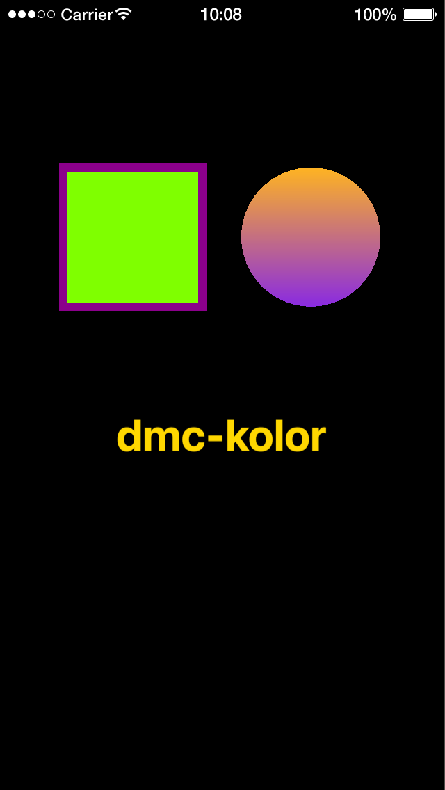

# dmc-kolor

Colors the way you know them for Solar2D (formerly Corona SDK): 0-255 values, hex strings and color names like "Steel Blue", translated into the 0-1 values Solar2D uses.

Solar2D describes a color with values from 0 to 1 (`1, 0.7, 0.13`). dmc-kolor lets you write it as `255, 180, 34`, `'#FFB422'` or a name instead, and gives you the 0-1 values for any color property or method:

```lua
local Kolor = require 'dmc_corona.dmc_kolor'

Kolor.setColorFormat( Kolor.hRGBA )  -- 0-255, alpha too

rect.fill = Kolor.translateColor( 255, 180, 34 )
circle.fill = Kolor.translateColor( '#8A2BE2' )
text:setFillColor( unpack( Kolor.translateColor( 'Steel Blue' ) ) )
```

## Features

- Three formats for color values: 0-1 (Solar2D's own), 0-255, or 0-255 with a 0-1 alpha
- Hex strings, `'#FFB422'`, with an optional alpha
- Named colors: the X11 colors come with it, or add your own
- Gradients: both of a gradient's colors are translated
- Set the format and the named colors once, in `dmc_corona.cfg`, or switch the format for a block of code
- Pure Lua, no plugins needed; MIT licensed

dmc-kolor 1.x changed `setFillColor()` and the other display methods themselves, for code written before Graphics 2.0. dmc-kolor 2 changes nothing in Solar2D: you call `Kolor.translateColor()` where you need it. [DMC-Corona-UI](https://github.com/dmccuskey/DMC-Corona-UI) uses it this way for its style colors, which can be numbers, hex strings or names.

## Quick Start

The following code will get you up and running in about 10 minutes in the Solar2D Simulator on macOS or Windows. It draws shapes in 0-255 and hex colors, then in named colors and a gradient.

Prerequisites: the [Solar2D](https://solar2d.com/) Simulator and a copy of this repository (`git clone https://github.com/dmccuskey/dmc-kolor.git`, or download the ZIP from GitHub).

### 1. Copy the Library into Your Project

Copy these from this repository into the root of your project folder:

```text
dmc_corona_boot.lua     loader for the DMC libraries
dmc_corona.cfg          configuration
dmc_corona/             dmc-kolor and its named-color files
```

**Going further:** keep the libraries in a subfolder, or combine several DMC libraries ([dmc-corona-boot Configuration](https://github.com/dmccuskey/dmc-corona-boot/blob/master/docs/configuration.md)).

### 2. Colors in 0-255 and Hex

Create `main.lua` in the project folder:

```lua
local Kolor = require 'dmc_corona.dmc_kolor'

Kolor.setColorFormat( Kolor.hRGBA )  -- 0-255, alpha too

local W, H = display.contentWidth, display.contentHeight

-- an orange square, as ( red, green, blue )
local square = display.newRect( W*0.3, H*0.3, 200, 200 )
square.fill = Kolor.translateColor( 255, 180, 34 )

-- a purple circle, as a hex string
local circle = display.newCircle( W*0.7, H*0.3, 100 )
circle.fill = Kolor.translateColor( '#8A2BE2' )

-- a half-transparent blue bar, as ( red, green, blue, alpha ), over both
local bar = display.newRect( W/2, H*0.3, W*0.8, 60 )
bar.fill = Kolor.translateColor( 0, 128, 255, 128 )

print( unpack( Kolor.translateColor( 255, 180, 34 ) ) )
```

Open the project in the Simulator. It shows an orange square and a purple circle, with a see-through blue bar across both, and the console shows the orange in Solar2D's values:

```text
1	0.70588235294118	0.13333333333333
```

`translateColor()` returns a table, `{ 1, 0.71, 0.13 }`. Assign it to a `fill` or `stroke` property, or `unpack()` it for a method such as `setFillColor()`.

If the console shows `module 'dmc_corona.dmc_kolor' not found` instead, `dmc_corona/` is missing from the root of the project folder.

### 3. Named Colors and the Config File

The format can be set once for the app, in `dmc_corona.cfg`, and so can a file of named colors. Open `dmc_corona.cfg` and remove the `-- ` in front of these two lines in its `[DMC_KOLOR]` section:

```ini
DEFAULT_COLOR_FORMAT = hRGBA
NAMED_COLOR_FILE = dmc_kolor.named_colors_hex
```

Then replace `main.lua` with this; it no longer calls `setColorFormat()`:

```lua
local Kolor = require 'dmc_corona.dmc_kolor'

local W, H = display.contentWidth, display.contentHeight

-- named colors, from the file in dmc_corona.cfg
local square = display.newRect( W*0.3, H*0.3, 200, 200 )
square.fill = Kolor.translateColor( 'Chartreuse' )
square.strokeWidth = 12
square.stroke = Kolor.translateColor( 'Dark Magenta' )

-- a gradient, its two colors in the default format (hRGBA)
local circle = display.newCircle( W*0.7, H*0.3, 100 )
circle.fill = Kolor.translateColor{
	type='gradient',
	color1={ 255, 180, 34 },
	color2={ 138, 43, 226 },
	direction='down',
}

-- text too
local label = display.newText( 'dmc-kolor', W/2, H*0.55, native.systemFontBold, 64 )
label:setFillColor( unpack( Kolor.translateColor( 'Gold' ) ) )

print( Kolor.getColorFormat(), unpack( Kolor.getNamedColor( 'Chartreuse' ) ) )
```

The Simulator restarts the app when the file is saved. It shows a green square with a purple border, a circle that fades from orange to purple, and gold text; the console shows:

```text
hRGBA	0.49803921568627	1	0
```



Names aren't case-sensitive: `'steel blue'` works too. An unknown name gives `nil` instead of a color, with no warning.

**Going further:** the formats, hex strings with alpha, your own named colors and the full API are in the [API reference](docs/api.md); the [example](examples/) shows every kind of color on one screen.

To update, copy `dmc_corona_boot.lua` and `dmc_corona/` again from the newer version. Keep your own `dmc_corona.cfg` if you have changed it.

## Documentation

- [API reference](docs/api.md): the color formats, `translateColor()`, named colors and color files, configuration, known issues
- [Examples](examples/): every kind of color dmc-kolor translates, on one screen

Everything else is listed on the [documentation home](docs/README.md).

## License

dmc-kolor is released under the [MIT License](LICENSE).
