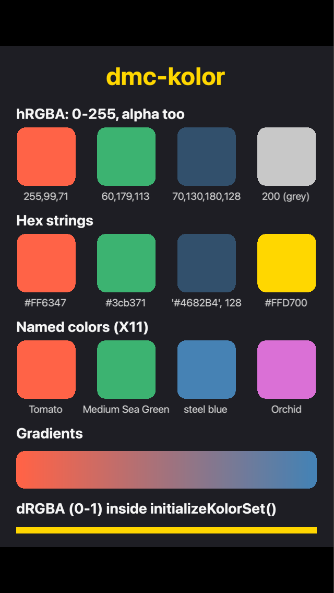

# Examples

Each folder is a complete Solar2D project with its own copy of the library: open its `main.lua` in the Solar2D Simulator.

| | |
|---|---|
|  | **dmc-kolor-basic**: every kind of color dmc-kolor translates, one row each, with the value under each swatch: 0-255 values (with an alpha, and a grey), hex strings, named colors, and a gradient from a 0-255 color to a named one. The last line is drawn in 0-1 values inside `Kolor.initializeKolorSet()`. Its `dmc_corona.cfg` sets the default format to `hRGBA` and loads the hex color file. |

The examples for dmc-kolor 1.x, which changed the display methods themselves, were removed in Sept 2026; they are in the git history before that.
